## 项目简介

- 基于**Tensorrt**加速**Yolov5 6.0**
- 支持**Windows10**
- 支持**Python/C++**

## 环境说明

- Tensorrt 8.2.1.8
- Cuda 10.2 Cudnn 8.2.1(**特别注意需安装两个cuda10.2补丁**)
- Opencv 3.4.6
- Cmake 3.17.1
- VS 2017
- GTX1650

## 运行案例(Windows)

从[yolov5 release v6.0](https://github.com/ultralytics/yolov5/releases/tag/v6.0)下载.pt模型，这里以yolov5s.pt为例。下载yolov5 6.0源代码和本仓库代码

```
git clone -b v6.0 https://github.com/ultralytics/yolov5.git
git clone https://github.com/wang-xinyu/tensorrtx.git
```

或直接到6.0页面download zip。

<div align="center">
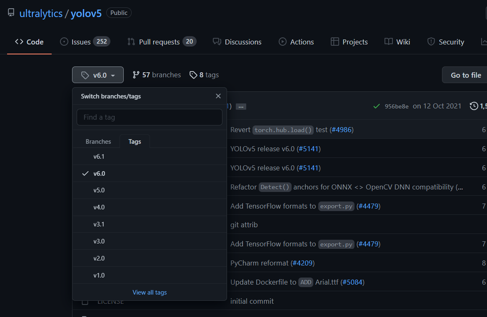
</div>

### 生成WTS模型

将仓库中的**gen_wts.py**和刚才下载好的yolov5s.pt拷贝至yolov5 6.0的目录下

<div align="center">
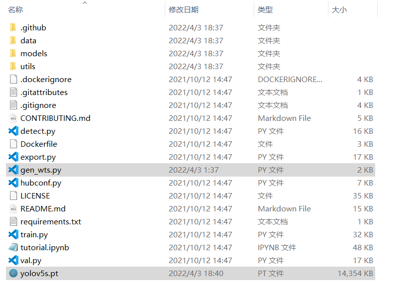
</div>

运行

```
python gen_wts.py -w yolov5s.pt -o yolov5s.wts
```

**-w参数为输入pt模型路径，-o参数为输出wts模型的路径。**

<div align="center">
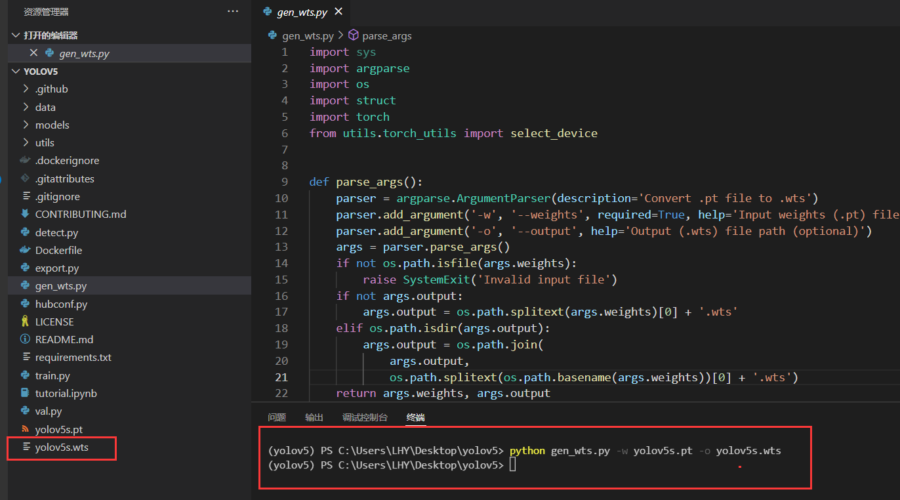
</div>

运行完毕后，yolov5目录下会生成wts模型，**这个模型用于之后转换为tensorrt专用的序列化模型。**

### 配置C++依赖

**Opencv**、**Tensorrt**如果已经安装完成，可以跳过下述步骤。

#### Opencv配置方法

1、在OpenCV官网下载适用于Windows平台的3.4.6版本 [下载地址](https://bj.bcebos.com/paddleseg/deploy/opencv-3.4.6-vc14_vc15.exe)

2、运行下载的可执行文件，将OpenCV解压至指定目录，例如 `D:\projects\opencv`

3、我的电脑->属性->高级系统设置->环境变量，在系统变量中找到Path（如没有，自行创建），并双击编辑，将opencv路径填入并保存，如`D:\projects\opencv\build\x64\vc15\bin`

#### Tensorrt配置方法

1、在tensorrt官网下载适用于Windows平台的版本 [下载地址](https://developer.nvidia.com/nvidia-tensorrt-download)

2、将TensorRT/lib下所有lib复制到cuda/v10.2/lib/x64下，将TensorRT/lib下所有dll复制到cuda/v10.2/bin下,将TensorRT/include下所有.h文件复制到cuda/v10.2/include下

3、我的电脑->属性->高级系统设置->环境变量，在系统变量中找到Path（如没有，自行创建），并双击编辑，将TensorRT/lib路径填入并保存，如`G:\c++\TensorRT-8.2.1.8\lib`

打开本仓库的**CMakeLists.txt**，修改**Opencv**、**Tensorrt**、**dirent.h**的目录，**其中dirent.h在本仓库的include中**，须**绝对路径**。修改`arch=compute_75;code=sm_75`，参考https://developer.nvidia.com/zh-cn/cuda-gpus，我的GPU为GTX1650，计算能力7.5，所以这边设置为`arch=compute_75;code=sm_75`。

```
cmake_minimum_required(VERSION 2.6)

project(yolov5) 

#change to your own path
##################################################
set(OpenCV_DIR "G:\\c++\\paddle_test\\opencv\\build")  
set(TRT_DIR "G:\\c++\\TensorRT-8.2.1.8")  
set(Dirent_INCLUDE_DIRS "C:\\Users\\LHY\\Desktop\\yolov5\\tensorrt\\include")
##################################################

add_definitions(-std=c++11)
add_definitions(-DAPI_EXPORTS)
option(CUDA_USE_STATIC_CUDA_RUNTIME OFF)
set(CMAKE_CXX_STANDARD 11)
set(CMAKE_BUILD_TYPE Debug)

set(THREADS_PREFER_PTHREAD_FLAG ON)
find_package(Threads)

# setup CUDA
find_package(CUDA REQUIRED)
message(STATUS "    libraries: ${CUDA_LIBRARIES}")
message(STATUS "    include path: ${CUDA_INCLUDE_DIRS}")
include_directories(${CUDA_INCLUDE_DIRS})
include_directories(${Dirent_INCLUDE_DIRS}) 

#change to your GPU own compute_XX
###########################################################################################
set(CUDA_NVCC_FLAGS ${CUDA_NVCC_FLAGS};-std=c++11;-g;-G;-gencode;arch=compute_75;code=sm_75)
###########################################################################################

####
enable_language(CUDA)  # add this line, then no need to setup cuda path in vs
####
include_directories(${PROJECT_SOURCE_DIR}/include)
include_directories(${TRT_DIR}\\include)

# -D_MWAITXINTRIN_H_INCLUDED for solving error: identifier "__builtin_ia32_mwaitx" is undefined
set(CMAKE_CXX_FLAGS "${CMAKE_CXX_FLAGS} -std=c++11 -Wall -Ofast -D_MWAITXINTRIN_H_INCLUDED")

# setup opencv
find_package(OpenCV QUIET
    NO_MODULE
    NO_DEFAULT_PATH
    NO_CMAKE_PATH
    NO_CMAKE_ENVIRONMENT_PATH
    NO_SYSTEM_ENVIRONMENT_PATH
    NO_CMAKE_PACKAGE_REGISTRY
    NO_CMAKE_BUILDS_PATH
    NO_CMAKE_SYSTEM_PATH
    NO_CMAKE_SYSTEM_PACKAGE_REGISTRY
)

message(STATUS "OpenCV library status:")
message(STATUS "    version: ${OpenCV_VERSION}")
message(STATUS "    libraries: ${OpenCV_LIBS}")
message(STATUS "    include path: ${OpenCV_INCLUDE_DIRS}")

include_directories(${OpenCV_INCLUDE_DIRS})
link_directories(${TRT_DIR}\\lib)

add_executable(yolov5 ${PROJECT_SOURCE_DIR}/yolov5.cpp ${PROJECT_SOURCE_DIR}/yololayer.cu ${PROJECT_SOURCE_DIR}/yololayer.h ${PROJECT_SOURCE_DIR}/preprocess.cu) 

target_link_libraries(yolov5 "nvinfer" "nvinfer_plugin")  
target_link_libraries(yolov5 ${OpenCV_LIBS})     
target_link_libraries(yolov5 ${CUDA_LIBRARIES})  
target_link_libraries(yolov5 Threads::Threads)     
```

### Cmake过程

在本仓库目录下新建一个**build**文件夹

<div align="center">
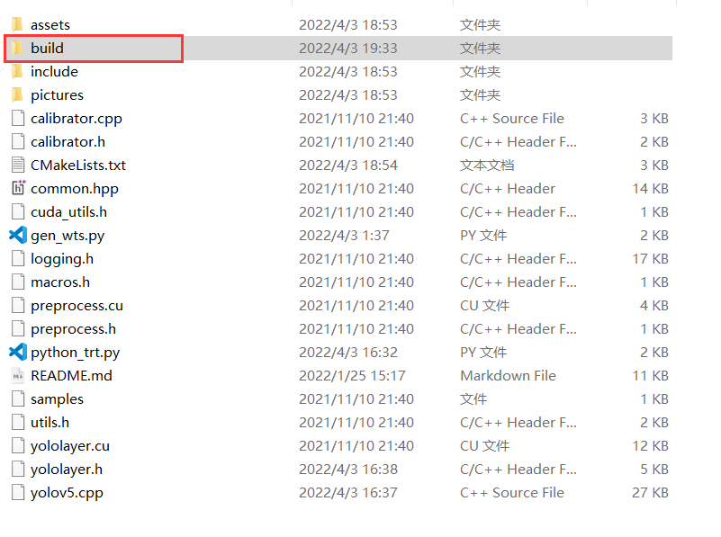
</div>
打开Cmake,选择本仓库目录，以及新建的**build**目录，再点击左下方**configure**按钮。

<div align="center">
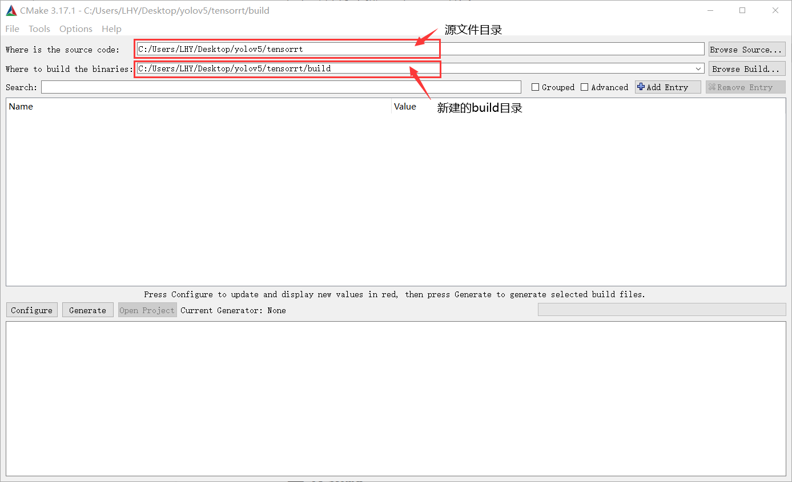
</div>

选择自己的Visual Studio版本，如2017，第二个框中选择x64，之后点击finish

<div align="center">
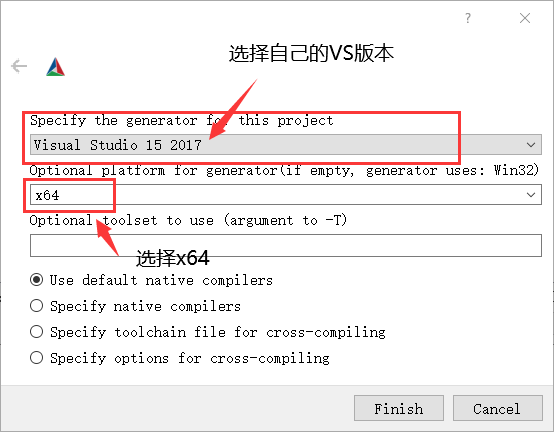
</div>

会自动加载CMakeLists.txt，添加库，正常运行如下

<div align="center">
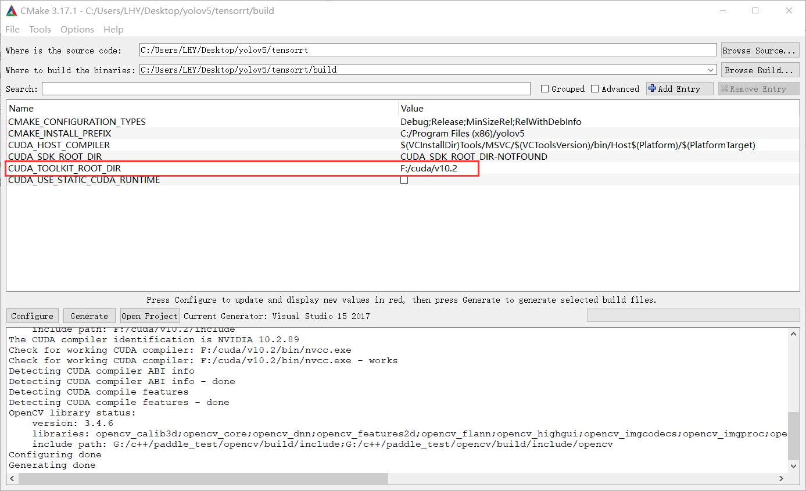
</div>

若出现红色警告，则需要修改框中信息。例如，**未找到cuda目录，则需要点击上图红色框，添加上自己的cuda路径**，再点击configure。一切正常之后点击generate，最后点击open project。

### 编译

<div align="center">
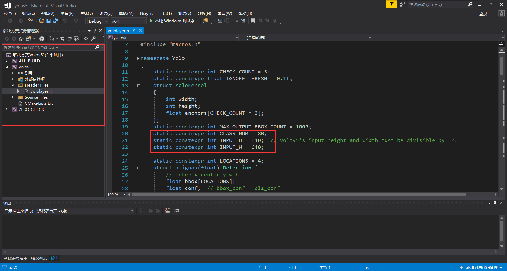
</div>

打开项目后，在左侧解决方案资源管理器中，一次展开yolov5,header files,打开yololayer.h文件，特别注意修改文件中的

```
static constexpr int CLASS_NUM = 80;
static constexpr int INPUT_H = 640;  // yolov5's input height and width must be divisible by 32.
static constexpr int INPUT_W = 640;
```

**修改为自己的模型类别数，输入大小，若没有修改，会运行报错！！**

将界面上方Debug改为Release，右键yolov5项目，点击重新生成。

<div align="center">
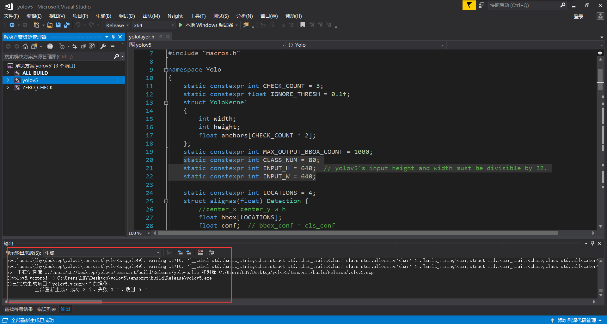
</div>

编译成功，没有报错！编译成功会打开build/Release，可以看到生成的exe可执行文件。

<div align="center">
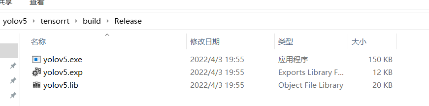
</div>

### C++运行

将第一步生成的yolov5s.wts模型复制到exe的文件夹中，在这个目录下打开cmd输入

```
yolov5 -s yolov5s.wts yolov5s.engine s
```

**我们这边使用的是s模型，最后则输入s，同理若为m模型，最后一个参数则需要改成m**

<div align="center">
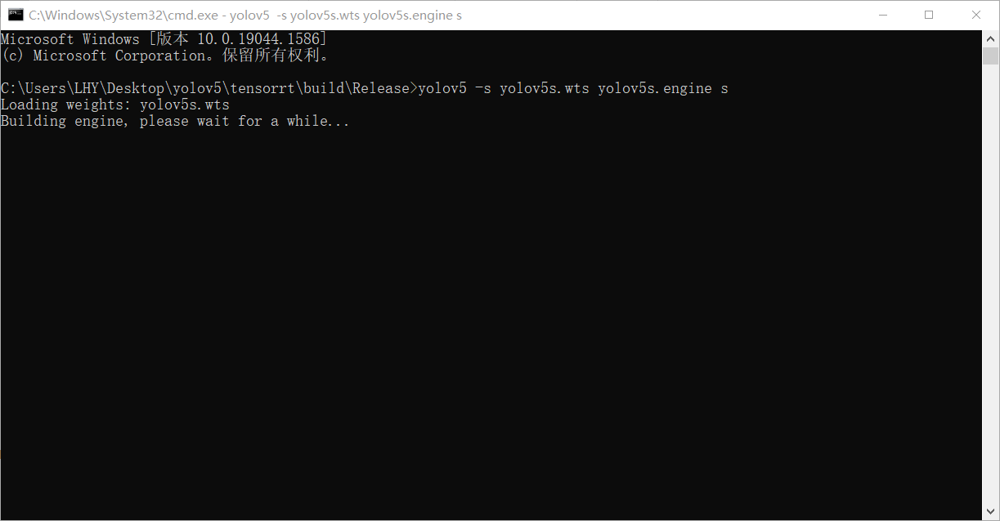
</div>

正常运行，此时程序在将wts转换为engine序列化模型，需要等待预计**10-20分钟**左右。生成engine完成后，会在文件夹下出现yolov5s.engine模型。将本仓库的**pictures文件夹复制到exe文件夹下**，尝试预测是否正确，输入：

```
yolov5 -d yolov5s.engine ./pictures
```

<div align="center">
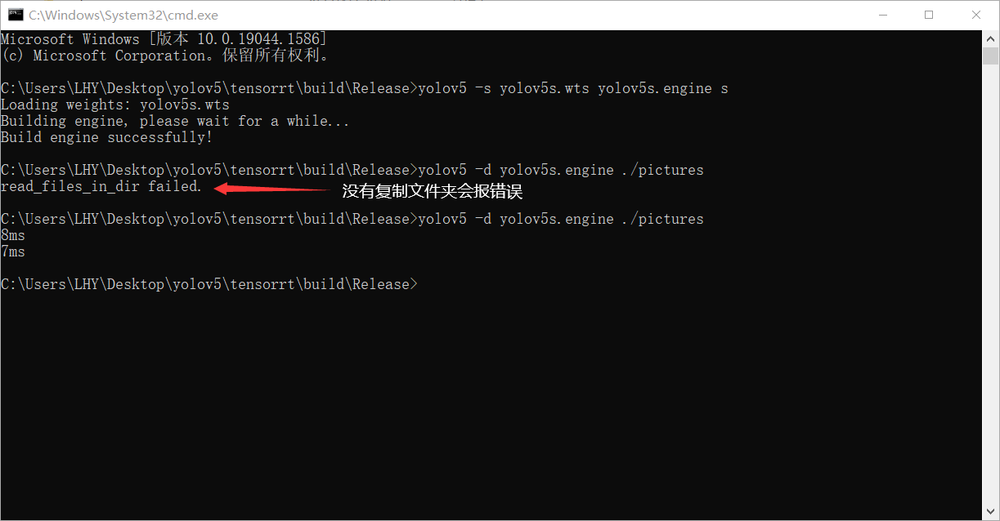
</div>

查看保存的图片，受否输出正确的框。

<div align="center">
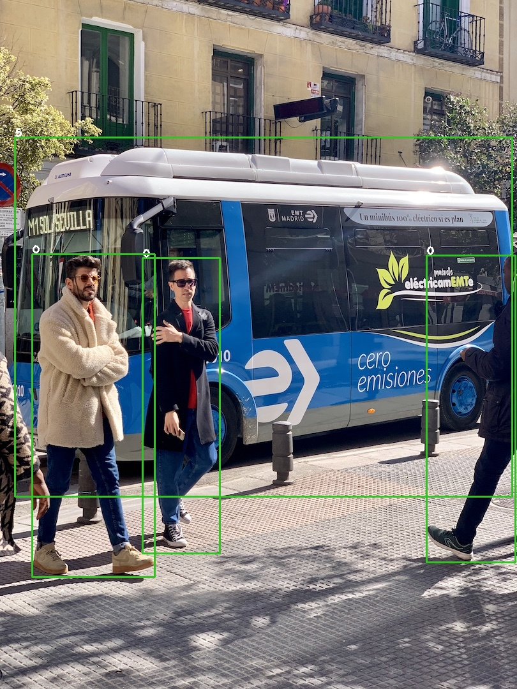
</div>

<div align="center">
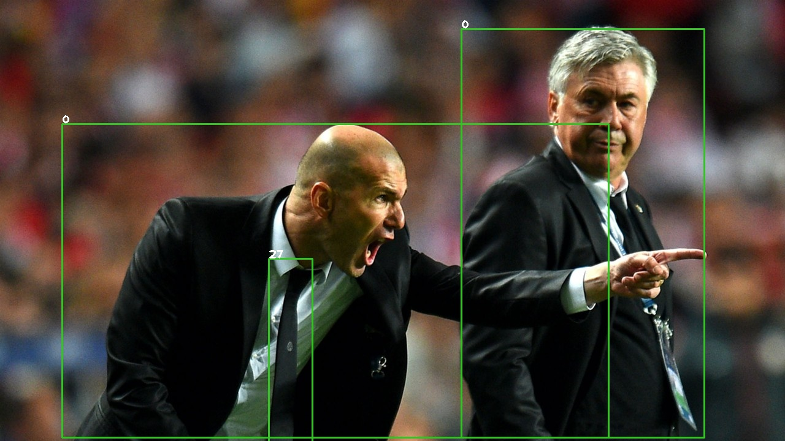
</div>

### Python部署

在C++部署正确之后，尝试使用python部署。**C++的代码预测只能通过文件夹内的图片**，对于**视频流或摄像头**预测需要修改代码，且目前**很多项目都是基于python语言完成**，故本仓库提供了**python**的部署方法。在刚才的C++工程中右键yolov5，点击属性。

<div align="center">
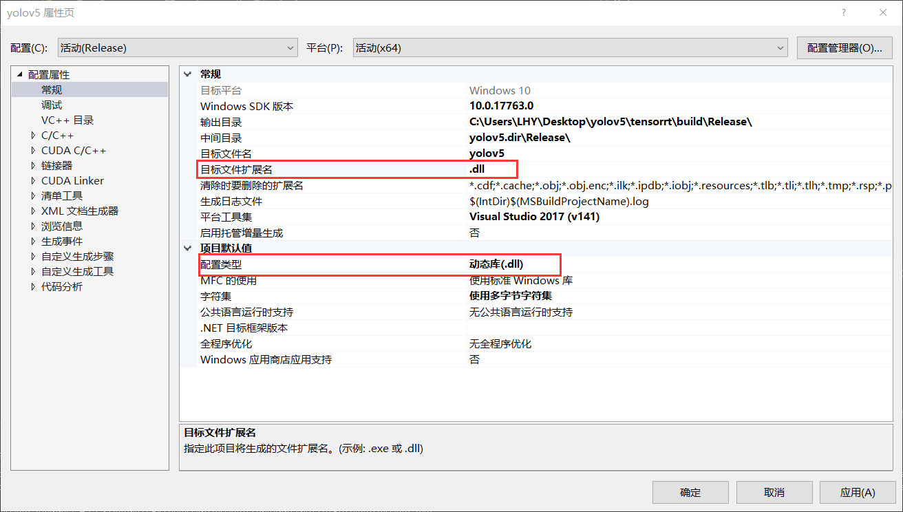
</div>

修改上述图片两行，都改为**DLL**，第一个需要手动输入。右键项目，重新生成，文件夹下会出现**yolov5.dll**，将本仓库的**python_trt.py**复制到dll文件夹下。

<div align="center">
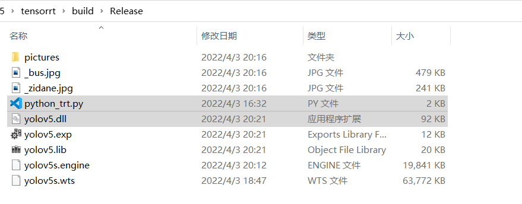
</div>

设置模型路径，**dll**路径和想要预测的图片路径，**特别注意模型路径需要加b''！！**

```
det = Detector(model_path=b"./yolov5s.engine",dll_path="./yolov5.dll")  # b'' is needed
img = cv2.imread("./pictures/zidane.jpg")
```

直接运行**python_trt.py**即可，**python**预测的最大优势在于支持了**numpy**格式的图片，极易融合进项目中。

<div align="center">
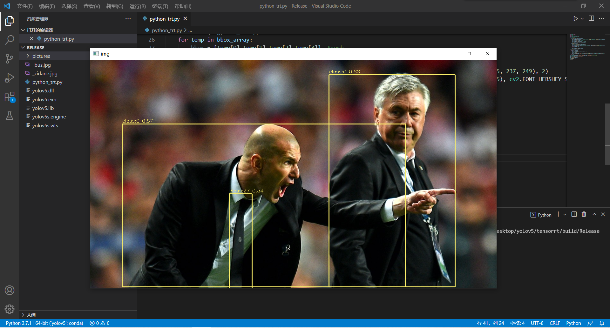
</div>

## 参考资料

https://github.com/wang-xinyu/tensorrtx/tree/master/yolov5

